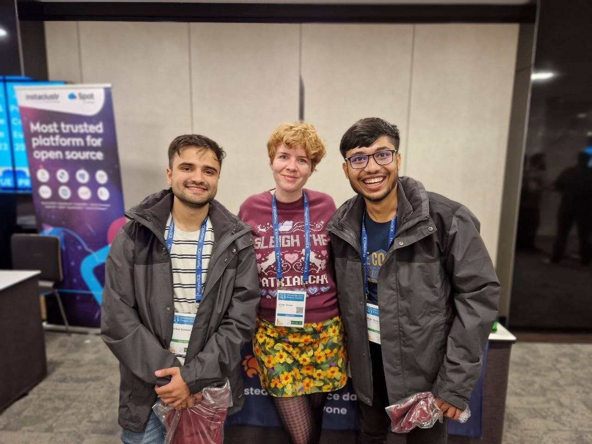

+++
title = "Prague Diary - Unforgettable experience at PGConf EU"
description = "My experience of attending my first ever conference in Prague "
date = 2023-12-23
draft=false

[taxonomies]
categories = ["postgresql","tech","open-source","conference"]
+++

One afternoon in January this year, while working on a project I made an entry to my private bucket list. _Give a talk at a conference_ and scheduled it to be done within the next 10 years. At that moment I had no idea the how/what/when of happening of this event. One year ago myself would be smiling at me now when I strike this wish/feat off the list in 11 months.

I was selected as a contributor to the PostgreSQL organization during Google Summer of Code'23. One day while having a casual discussion with my mentors, I was asked if I was interested in speaking about my experience and the project at an upcoming conference in December. Since my college was to be on a vacation during the proposed timeline, I thought this to be an amazing opportunity. Few days ago, I was a fortunate to make it to the conference and it was an absolute bliss.

## The Conference

PostgreSQL Conference Europe 2023 was scheduled from 12th December to 15th December 2023 in the city of Prague, Czech Republic. This was my first conference and even my first travel out of my country. I was to talk about my [GSoC project](https://github.com/rajivharlalka/gsoc23-postgres) [pg_statviz](https://github.com/vyruss/pg_statviz) at the conference and also communicated to the organizers for being a part of the volunteering team.

## The Travel

I made all my plans perfect and left home on 11th to reach the location on 12th according to plans. But not all things work as they are planned. The 22 hour flight was converted to a super long 46 hour flight itinerary when one of the connecting flight, Delhi to Istanbul,  got cancelled and I was re-routed for the next via Mumbai. After being inches away from cancelling my entire trip, I finally reached the venue on 13th late night with 3 hours of sleep in the last 48 hours. I was hell tired.

I had already missed a day of the conference and was quite sad about it. On reaching the venue, I got to meet a number of people, some with whom I had been chatting over emails and Slack for the last six months. It was an absolute pleasure of getting greeted after this long journey. The news and story of my travel had already spread among the other folks at the event and it became an easy conversation starter for me. Listing everyone I met would be super difficult for me, but for a few names [Andreas](https://mastodon.social/@ascherbaum), [Dave Page](https://fosstodon.org/@pgSnake), [Boriss Mejias](https://twitter.com/tchorix), [Jimmy Angelakos](https://fosstodon.org/@vyruss), [Tomas Vondra](https://twitter.com/fuzzycz), [Floor Drees](https://twitter.com/DevOpsBarbie), [Pavlo Golub](https://twitter.com/PavloGolub), [Jonathan Katz](https://twitter.com/jkatz05), [Chelsea Dole](https://www.linkedin.com/in/chelsea-dole/) would be some of them. I was overjoyed connecting and sharing my story with them.
</img>

## The First Day (for me)
The next day started out with talks on [SQLPage by Ophir](https://www.postgresql.eu/events/pgconfeu2023/schedule/session/4687-sqlpage-building-a-full-web-application-with-nothing-but-postgres-and-sql-queries/), about [using roaring bitmaps by Ants Aasma](https://www.postgresql.eu/events/pgconfeu2023/schedule/session/4762-counting-things-at-the-speed-of-light-with-roaring-bitmaps/) and [solving IOT usecases with PostgreSQL by Chris](https://www.postgresql.eu/events/pgconfeu2023/schedule/session/4708-iot-with-postgresql/). I got a good chance to interact with these speakers since I was also room hosting for them in their respective slots. I missed the next two talks, as I was in my room preparing myself for my talk, nervousness and stage-fear already started to kick in. 

## My Presentation

I went over my slides quite number of times and then a chat with some friends to relieve my anxiety. From outside I was prepared, but inside me was an erupting volcano of nervousness. I arrived at the hall 10 mins before my talk to setup my system and was glad to find Boriss and Pavlo there to help me out during the presentation. [Devrim](https://twitter.com/devrimgunduz) was my room host, and we had a good chat on various things, from how I got to know him to his effort in getting the pronunciation of my first name right. 

In a couple of minutes, I was ready with my mic and screen-sharing setup and took a deep breadth to calm myself. To cheer myself up, I took a quick selfie to have a memory of me with the big screen with my slides. It was time and after the introduction by Devrim , I started my talk. The start was difficult but once I picked up pace, it started getting comfortable. I tried keeping the pace to not run fast but soon I realized I was ahead of time and running out of slides. When I starting speaking on my experience during GSoC, I took a step out of my slides and started to talk from my heart. It was this part I wasn't prepared to speak on and neither did I know I would need to. It was a call from the moment and I took it. I spoke on my experience, different people I got to connect to and my overall experience with the community. Once I was contended, I continued with my slides and slowly ended my talk. Next followed some minutes of Q/A where some good questions came up, though I don't remember them now. Now I felt a sense of relief. The various videos suggested by Boriss on how to be a first time speaker were really helpful. It was done, I could finally strike the item off my bucket list. Since my talk was the last of the day, I along with my friend [Akshat](https://twitter.com/Kyllex5), went out to explore Prague and we had a good time exploring the city.

  
  

## The Second and Final Day

Now it was time for the final day. Couldn't believe that the conference was ending so soon. One by one, I got to attend talks on various topics and they were super great. I also took the opportunity of visiting booths setup by different sponsers and meeting them, understanding what's cooking there and had great chat with them. Some of the people I remember are [Hans-Jürgen Schönig](https://twitter.com/postgresql_007) from Cybertech, [Adam Hendel](https://twitter.com/adamhendel) from Tembo, [Tejasvi Kashi](https://www.linkedin.com/in/pct/) from PGEdge, people from Ubicloud and [Adam Wołk](https://www.linkedin.com/in/adamwolk/) and [Paul Meyer](https://www.linkedin.com/in/paulmeyer/) from Microsoft. Having get to connect to them was quite insightful in a number of ways and our chat didn't limit to PostgreSQL. I remember talking about my career path and maybe-decisions with Adam infront of Tembo's booth. These chats made me feel more inclusive in the community as being someone quite new and starting out, it was a different experience I could have. Next we had a series of lightning talks which was amazing. And in no-time was the Closing remarks with various metrics about the conference. I was thrilled to see that the conference had a participation of 720 attendees, which is said to be the largest among all PostgreSQL conferences worldwide till date. With the ending group photographs with all the speakers and some parting gifts the conferences ended in reality but for me, I wanted more. But things have to come to an end some day and this was it. I had got presents for my mentor's and saw this the perfect time to hand them over too. It was my pleasure being guided by them. I also got to meet an Indian, [Arindam Guha](https://www.linkedin.com/in/arindam-guha-439084b6/), at the conference. It was a great pleasure meeting someone from my country there and we had a good time chatting with him over number of things. 

  
  

That night, I was invited along for a Karaoke party at [Brutal Panda Bar](https://restaurantguru.com/The-Brutal-Panda-Prague) and we had lots of fun singing, dancing and making merry. Karaoke was something I had never done before and I hate myself for my own singing. Apologies to everyone there who had to hear my singing but for me, it was utmost pleasure. I never thought shouting at the top of my lungs could be fun. We were accompanied by some other folks and soon we started singing songs of some language I didn't understand (according to some it was Russian,and from some it was Czech, though it doesn't matter) but that turned out to be super amazing again. I specially thank Floor Drees for the plan and having me there.

## Finally it all ends

For the last day(next day when the conference ended) of most people, we left the venue to explore the city and see what's there for Christmas. Since some of the people had to leave in the evening, we took a quick ferry ride on the Vltava river and the view was surreal. I also met some new people and recognized [Matthias](https://twitter.com/mmeent_pg) in a sec, though I misremembered him from reading his blogposts by reading his comments on Slack. We sat on the same table along with Boriss and Akshat, having gossips all along the ride. It was soon late afternoon and people had to slowly leave to catch their flight. Akshat and I also took our leave and moved ahead to explore more about the city.

Since I had already planned by trip by taking extra three days to travel and explore more what the city had to offer, I got to see a number of places and connect to number of more new people. I would leave this for another blog, but for the conference it ended here. 

Speaking at PostgreSQL conf EU was one of the biggest feat for me in the last couple of months(years?) and I brought a number of great memories with me from the event. I could understand how a community bonding helps in building software, and how the community supports one another and how it unites as a family. And now I feel happy to be a part of this community. I would like to thank the entire PostgreSQL community for making me feel so inclusive, there wasn't a  moment I had to feel I am meeting people for the first time. Another big thanks to PostgreSQL.EU organizing committee for having me there and sponsering my trip, I possibly would not have been there without your support. And also thanks to my parents, friends and people at [KOSS](https://kossiitkgp.org) who's constant support and help has kept me guided.

Fin.