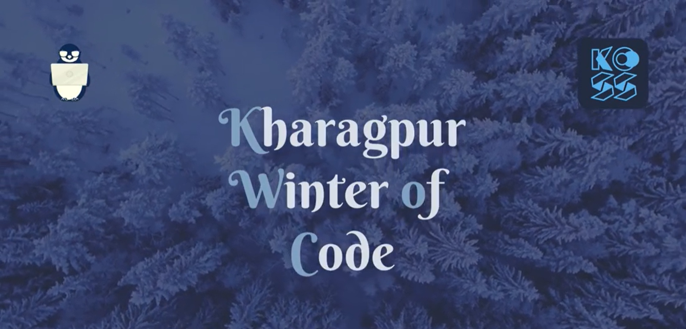

+++
title = "Being all in one"
description = "My crazy involment in KWOC-2021"
date = 2022-01-11
draft=false

[taxonomies]
categories = ["kwoc","learning","mentor","student","non-tech"]
+++

How does it feel to be a mentor, student and a developer of the platform all at once. I would like to tell how I felt it. Kyool !!

## <u>Background</u>

Every winter, [Kharagpur Open Source Society](https://kossiitkgp.org/) organises a month long coding program [KWoC](https://kwoc.kossiitkgp.org). The aim of the program is to give a experience of how events such as GSoC are held and promote Open Source Contributions. Mentors having different project are given a platform to upload their idea and students all around the world are eligible to register for the event. After successful completion of the program, the students are provided with a certificate.

## <u>From a Developer's POV</u>

As a member of the society , I was one of the person helping organize the event. I took up the work of adding features and making changes required to the backend repository , that being my field of interest. Though I worked with javascript all this time, picking up a golang backend was kinda not in line of my daily work. But going out of mainstream work is what I crave for. So yes, I went on to grab the opportunity.

Learnt golang from scratch , wrote some basic programs to get accustomed to the langugae and went on to understand the already written codebase. The backend used mux as a http request handler,gorm as an postgres ORM and a [supabase](https://supabase.io/) postgres instance as a database.Thanks to the well written code a the comments of the previous dev, understanding that wasnt much pain in the ass .

In a span of next 15 days, I designed some new api endpoints and updated some old. Add foreign keys to the database(:heart:) table which were missing last year . Got to know something new called [Eager Loading](https://gorm.io/docs/preload.html). Also had my first experience setting up nginx and deploying the backend binary to an AWS EC2 server.

## <u>From a Mentor's POV</u>

Our platform was ready just in time and we were ready to go. To test out all our platform's functionality, I added one of my project , [Accio](https://github.com/rajivharlalka/accio) as a project . Yes , you saw it correct, it's the same theme that powers this blog. I was already a lot behind my schedule in setting up this blog and saw this as a opportunity to get my work fastened. What started as a joke ended up me mentoring a project.

I took my companion [Chirag](https://chiragghosh.me) as my co-mentor as he was the one helping me on the project as well. We made our discord server for communicating with the mentee's . To my surprise , my project had gathered a lot of attention. Being an Open Source mainter is tough, felt this during the time. Had an idea of talking to contributors while one my seniors [Sahil](https://sahil-shubham.in) mentored me in some of the projects. Was able to solve mentee's issues and tried to do good code review. Hoping the mentee's had a great time contributing to my project too.

## <u>From a Student's POV</u>

Along with working on my project(Accio), I was also actively contributing to another project , [Instant-Apps](https://github.com/felvin-search/instant-apps) by [Felvin](https://felvin.com) . Havent you popped up with some fancy tool apps by Google for some specific search queries. Felvin aims to make them accessible to the most basic tasks. Users wont have to crawl different pages to get their work done when everything can be done by the search engine itself. 

This project taught me so much , I cant even think to jot it down. From understanding how to use git and github the right way to going to making React apps, styled components (somethng which I would never thought of using) , it has been a long way. Special credits to [Sahil Shubham](https://github.com/sahil-shubham) for responding to my most useless queries :simple_smile: 

Oh, you reached the end of my shitty story. Congrats on that :tada: . Would come again with some another shitty story, some another shitty day . Till then See Ya!