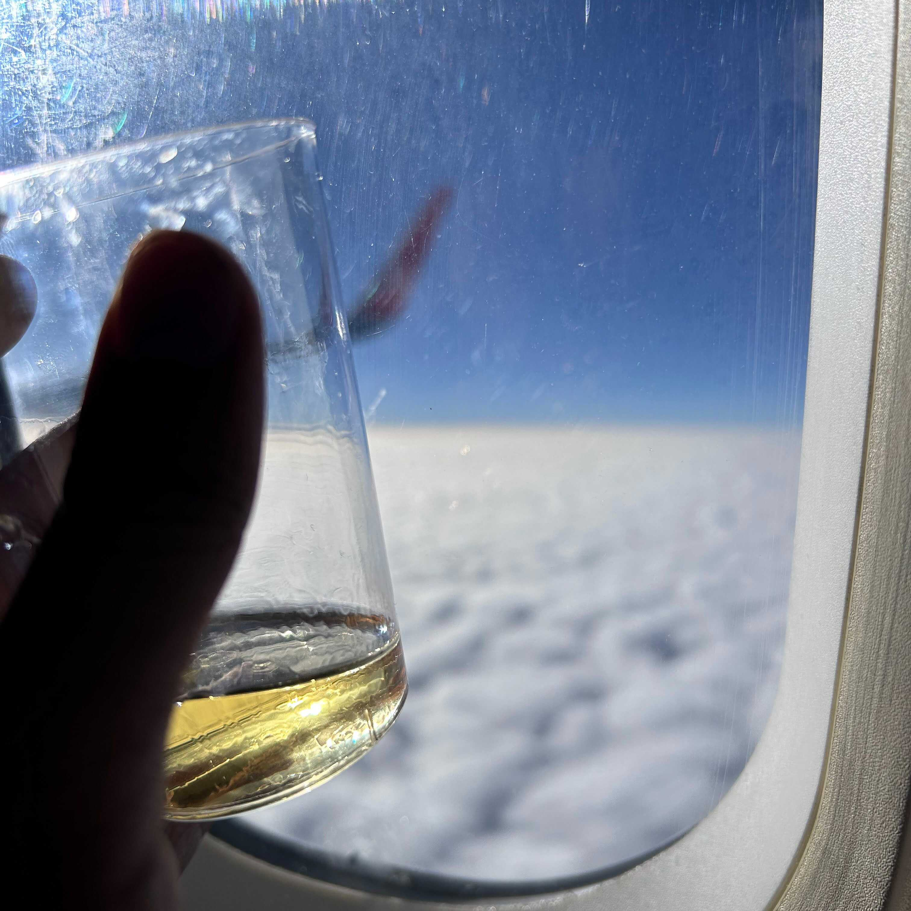
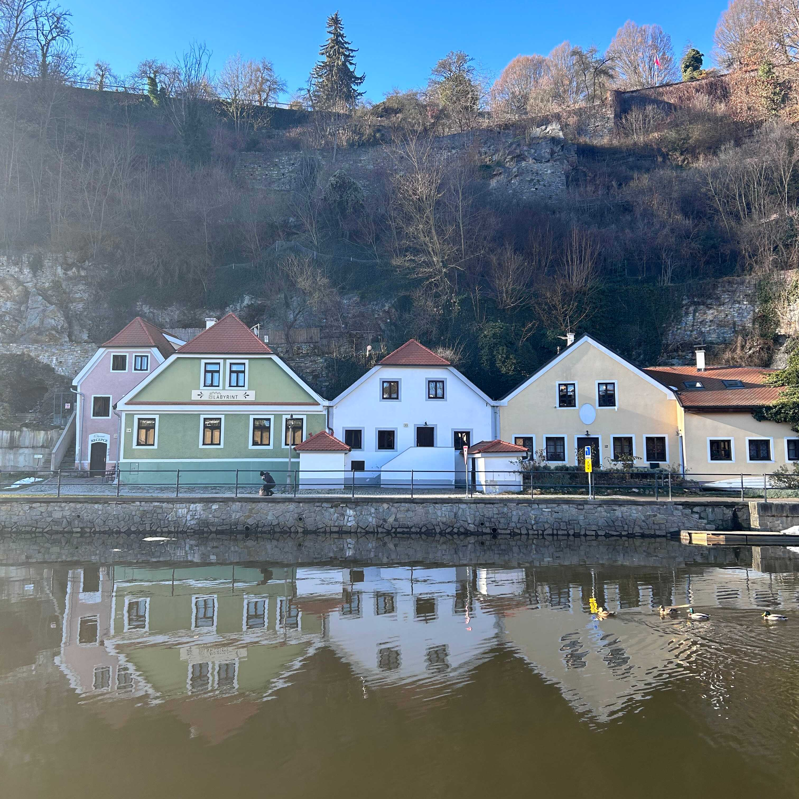
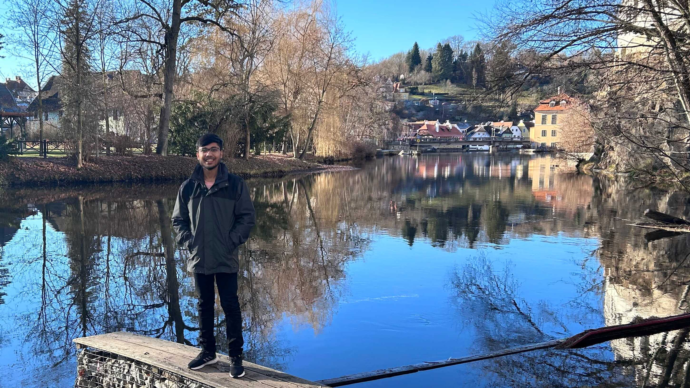

+++
title = "Year 2023 and Resolutions for 24"
description = "A letter to self on year 2023 and changes planned"
date = 2023-12-31
draft=false

[taxonomies]
categories = ["life","student","non-tech"]
+++

After thinking 10s of time how to start this, ig this would be the beginning. I planned on a number of things for this year, and this decade; some got fulfilled, some didn't. It's time to carry-over some of those debts to the next year in the hope to get them full-filled. Each of them could be categorized in one of many self-made buckets, and would arrange those in the form of sub-headings.

## Friends

Most of my time in the recent years have been revolving around my friends. Even to my accomplishments in JEE, I would give lots of credits to my friends who helped me during the study and sad time. Even for most of the time I remember myself, I find lying down in one of my friend's room munching the snaks they got from home. To most of my ideas, my thoughts, my celebrations and my emotions are associated to some friend.

Though I felt in the last few months, I have been drifting away from most of my friends in terms of ideas and thoughts. I guess I don't want to have that conversation again because their thoughts becoming my critic, but isn't that needed too? I believe I have been avoiding people who work/say/think quite against/opposite mine and tend to reject their opinions without thinking a lot.

Resolution: Try to think on every suggestion/opinion thrown at me and try to fair to myself.

## Books

This is one of the habits I have been dearly trying to acquire but failing every time. This year I merely read 2 books.

1. Metamorphosis by Franz Kafka
2. The Shiva Trilogy: The Immortals of Meluha by Amish Tripathi

Though it isnt true that I didn't try to pick more, but for most of them, it was always boil down to leaving them midway. Having heard from most people that not all books are meant to be read completely, but I don't think I am a good judge at this moment to have the opinion to either complete or read it to the end.

Resolution: To try to grow this 10x i.e. have 20 meaningful reads in 2024. I would try to account them all on my Goodreads to have a regular account to myself.

## Tech

Every time I read a tech blog, I understand this is something new. There is always a more to things. And this parts excites me the most. I wish to strive for the day when I can say to myself, "I am the best in xyz". Learning everyday has become one of my routines and this is something I wish to continue forward. To list fown, here's my tech setup I had for 2023:

- Phone: Iphone 14 (though used my Samsung M31 for most of the year, now switched completely to iOS)
- Laptop and OS : Dell G3 3500 with Arch Linux <3
- Monitor: SAMSUNG 24 inch IPS Backlit
- Mouse: Dell MS 116
- Keyboard: Cosmic Byte Artemis 68 Key
- Occasional Server Uses: Azure VM's

I discovered Omnivore and use it for most of my reading usecases. It solved most of my pain-points, and love it's support for PDF's and maling lists.

Resolutions: To get better, everyday. Read and go hands-on with projects. Try something ususual.

## Movies and TV series

Though I don't watch a lot of movies or tv series, I restrict myself to one's recommended to me. This helps me to stop thinking and discovering what to watch and keep myself contended to limited content. Generally I love Thriller Suspense genre, but am open to watch all. This year some of my favourites were:

- Se7en
- Asur Season 2
- Jojo Rabbit
- Rick and Morty

Resolutions: Keep having fun.

## Writing

I am glad I improved on this field. Number of blogs in the year '23 were 3x of that of 2022 and had enjoyed writing them. Though wanted to document more on my learnings and daily life. Pen-Paper Journalling was something I wanted to try but couldn't accomplish.

Resolutions: Try different forms of journaling, and keep it consistent. Regarding blogging, keep it consistent with the current rate.

## Fitness

This year's summer did not have a good impact on my physical fitness since I was mostly sitting on my working table and had least workout. Tried with playing Squash and am loving the game. Mind and body becomes so refreshing after each game, it feels great. Another reason for loving the game is the great people and coach over there.

Resolutions: Maintain a regular fitness plan, have a better exercise routine. Be able to run two consecutive 2.2 in a go.

## Travel

Be it deep valleys or rivers with sparkling water, from peaky mountains to sandy deserts, each terrain has it's own beauty and it's quite intribuing to understand about each of different places. Even though two different places can have similar terrain, they always something more to offer. This year, though I didn't get to visit a number of places, each of the place has deep memories in me. Some of them would be:

1. Mandarmani Beach - Even though this beach is quite near to KGP, it was after four years of my college life, I could get to visit this place. It was a great experience with some of good friends.
2. Jaipur and Sakhu
3. Darjeeling - The Queen of Hills of India, with friends is a must visit. Even though my trip was a short one, it was quite memorable. From great sunrises to the lush green tea gardens, it was a mesmerizing view. Again a must visit.
4. Prague, Český Krumlov and Kutná Hora - My first International trip after attending PostgresConf Europe. This calls for another post.

Resolutions: Visit more places, talk to more people and keep the introvert me outside.

I believe these buckets complete more than enough all the things I had in mind, if not listed maybe didn't fall into the buckets and I don't remember it anymore. Excited to see myself in 2024. For ending here's some of my memories from 2023.

  

    
  

  

    
  

  

    
  

Fin.
