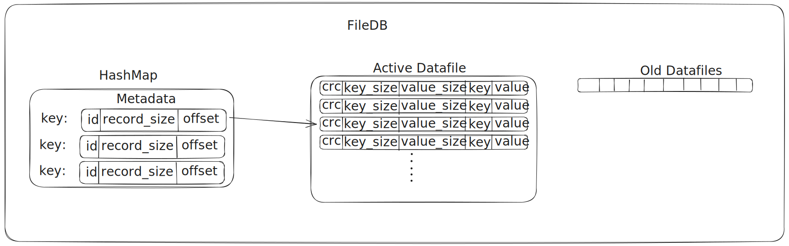

While searching around the internet finding a project idea at the intersection of database, systems programming, I came across [BarrelDB](https://github.com/mr-karan/barreldb), BitCask implemented in Go by [MrKaran](https://github.com/mr-karan). The paper being small, to-the-point and readable sparked my fire to implement it. Since I had read a bit of implementation of BarrelDB, I did not want to use Golang and looked for something new to try, when Zig caught my attention.

[Zig](https://ziglang.org) is a newer low-level programming language started by Andrew Kelley, which brings in a newer paradigm of memory using comptime. Finding it closely related to C/C++ and the same low-level functionality from memory to file-system, I picked Zig as my language.

---

## FileDB

FileDB(https://github.com/rajivharlalka/filedb) is a key-value disk-based datastore inspired by the [Bitcask Paper](https://riak.com/assets/bitcask-intro.pdf) by [Riak](https://riak.com/), a distributed database. It provides high throughput due to it's simple append only file and log-structured HashTable.

### Log-Structured HashTable

The log-structured Hashtable maintains a key-value pair of available keys and their location on disk. This provides an easy way for O(1) lookups of values on the disk using the metadata stored in the table.

The key of the hashtable is the key of the record and the value is [file_id, record_size, record_offset]. The file_id is the id of the file which stores the value of the key. With the record_offset and record_size, a reader can directly seek to the necessary position and read the relevant number of bytes. This makes fetching records O(1) operation.


_MetaData Record in HashMap_

### Active and Old Datafiles

FileDB maintains an active datafile to store insertions in append-only way. The append-only storage mechanism becomes a huge factor for high throughput of the system since multiple writers can write on the same time by locking the file for small durations.

On every restart or when the size of the file exceeds an acceptable limit, the active datafile is marked as old and added t a list of oldfiles which are read-only. A new datafile is started on disk which now accepts the insert operations.

A datafile is a combination of [crc, timestamp, key_size, value_size, key, value] appends one-after-another. The record_size in the Hashtable is the size of this entire record and the offset the start position of the record in the file. Once these two quantities are known, the record is appended and insertion is completed.


_Datafile Record to be appended on Disk_

The Record is encoded in binary format, which makes serialization-deserialization fast.


_Different parts of FileDB_

### Periodic Jobs

1. Compaction: Every `compactionInterval`, a job reads all the active keys from the datafile and compacts them into a single datafile, deleting all the oldfiles existing. This prevents huge number of old_files and keeps the directory clean of the deleted keys.
2. Sync: Every `syncInterval`, a job sync the current active datafile and syncs it to disk. This prevents major loss of data on crashes.
3. Rotation: Every `dfRotationInterval`, a job checks the size of the current open datafile and exceeding `maxDfSize`, it rotates the file.

### HINTS File

To provide faster startup time of a filedb, during compaction and stopping filedb, a HINTS file is updated, which contains the contents of the HashMap in a binary format.
On startup this file can read quickly and the database would be ready to accept connections.

### Redis-Compatible Webserver

Redis provides a very handy cliet (redis-benchmark) for benchmarking key-value pairs, if there exists a webserver that understands the RESP Protocol. Having implemented this, benchmarking filedb on get/set requests became quite easy.

```shell
127.0.0.1:6379> RING
(error) ERR unknown command
127.0.0.1:6379> PING
PONG
127.0.0.1:6379> get abcd
(nil)
127.0.0.1:6379> set abcd def
OK
127.0.0.1:6379> get abcd
"def"
```

#### Benchmark

```shell
redis-benchmark -p 6379 -t set -n 10000 -r 100000000
Summary:
  throughput summary: 13736.26 requests per second
  latency summary (msec):
          avg       min       p50       p95       p99       max
        3.615     0.088     3.455     6.831     8.831    14.919

redis-benchmark -p 6379 -t set -n 200000 -r 100000000
Summary:
  throughput summary: 14375.04 requests per second
  latency summary (msec):
          avg       min       p50       p95       p99       max
        3.452     0.072     3.087     6.767    10.647   114.303

redis-benchmark -p 6379 -t get -n 100000 -r 100000000
Summary:
  throughput summary: 44286.98 requests per second
  latency summary (msec):
          avg       min       p50       p95       p99       max
        0.573     0.088     0.519     0.967     1.447     7.495

redis-benchmark -p 6379 -t get -n 1000000 -r 1000000000 --threads 10
Summary:
  throughput summary: 104876.77 requests per second
  latency summary (msec):
          avg       min       p50       p95       p99       max
        0.405     0.032     0.375     0.831     1.295    26.047
```

## Personal learnings

Watching myself fall into the trap of the memory management (double-free, use-after-free etc), which I had read only theoritically till now, was dreadning. Zig's compiler told me what I was doing wrong, but finding a solution to them was filled with learnings. There was even one instance I was so lost in finding a memory free problem[^1], weeks later I [posted](https://discord.com/channels/605571803288698900/1369563653505945662) on Zig's Discord and found the problem and it's solution myself minutes after posting the question. (Duck Debugging Haha :duck:)

Though the project is quite simple, a basic hashtable with a open file for reading, implementing each function provided a lot of insight on the internals of a general database. With Andy Pavlo's lectures flashing in front of me, I have getting ideas to implement on top of this project (Future Work).

I give Zig a lot of credit for my learnings as somehow the language being insanely easy to get, provided the right model for understanding the internals while not going deep into the language's learning curve. (Checkmate Rust).
Even though I didn't use a lot of the language features such as metaprogramming, and comptime I would create something new utilizing them again. :)

[^1]: When inserting a record on the database, the application reported memory leaks, and I had no clue why. And having had made a lot of change without making a commit, I had no clue which part of the code leaked. Slowly restricting the zone, I concluded it to the function which stored the records on the hashmap. Later I found that when the value of a key was being updated, the earlier dynamically allocated value wasn't being freed and I was just replacing it with the new value, thereby causing a leak. Finding this error and fixing made me so happy momentarily, I was overjoyed for fixing a problem I created for almost a week.

I still feel that a number of performance gains are possible and I'll take some time out improving the benchmarks and crossing the 100k mark for SET operations.

## Credits:

1. [Bitcask Paper by Riak](https://riak.com/assets/bitcask-intro.pdf)
2. [Go Implementation of Bitcask](https://github.com/mr-karan/barreldb)
3. https://www.openmymind.net/Basic-MetaProgramming-in-Zig/
4. https://pedropark99.github.io/zig-book/ (Great Starting point to Zig)
5. https://zig.guide/standard-library/
6. https://zighelp.org
