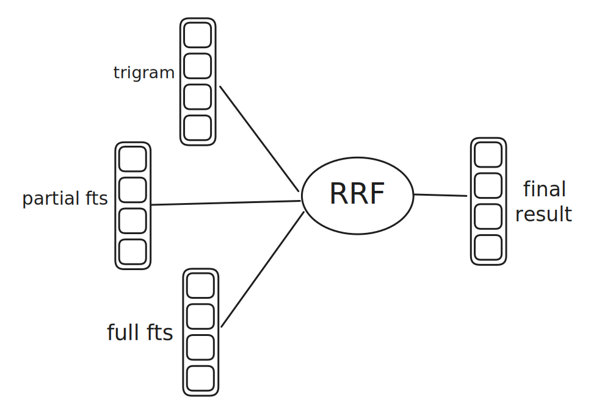

We, at [MetaKGP](https://github.com/metakgp), released [IQPS](https://qp.metakgp.org)-Intelligent Question Paper Search earlier this year, an advancement of the previously famous [MFQP](https://github.com/metakgp/mfqp). But having been asked about what's the advancement or what is so intelligent about the new version of website hosting just question papers, it is the improved search algorithm that makes it better.

MFQP was probably built as a solution to solve the immediate problem of a directory with number for question papers, and used a simple fuzzy search algorithm to search the papers. As time passed, the current database stores ~9k different question papers, across more than 90 different courses and 10 years of aggregation, and the fuzzy model started to produce results failed to rank relevant papers on top of irrelvant ones given the search query. Considering that it had been more than five years since the project received active development, a revamp was necessary.

This blog explains how we used an [`RRF`](https://learn.microsoft.com/en-us/azure/search/hybrid-search-ranking) model leveraging Full Text and Trigram Search on PostgreSQL to make the search better and fast.

## What do people search

Each question paper has two main part which each student usually had as their search query:

1. Course Code
2. Course Name

While observing the different search queries my friends have to find the relevant paper, I found three pattern most common in the large corpus:

- starting with the course code
- missing filler words in course name
- spelling mistakes in the query

On some observation on how the data was stored earlier, a json file, the fuzzy search was applied to a single TEXT field: `course-code code-name`. It made sense why having the search query start with the course-code produce better results.

Though fuzzy search fixed the second and third pattern issues, it was also matching a number of other papers and due to lack of ranking the results, relevant papers sank to the bottom of the list.

## Improving the Data Model

As a major change to the architecture, we migrated the data from a single json file served to each user on load to a single postgreSQL table schema.

```sql title="schema.sql"
CREATE TABLE IF NOT EXISTS iqps (
    id integer primary key generated always as identity,
    course_code TEXT NOT NULL DEFAULT '',
    course_name TEXT NOT NULL,
    year INTEGER NOT NULL,
    exam TEXT CHECK (exam IN ('midsem', 'endsem') OR exam = ''),
    filelink TEXT NOT NULL,
    from_library BOOLEAN DEFAULT FALSE,
    upload_timestamp TIMESTAMP DEFAULT CURRENT_TIMESTAMP,
    approve_status BOOLEAN DEFAULT FALSE,
    fts_course_details tsvector GENERATED ALWAYS AS (to_tsvector('english', course_code || ' ' || course_name)) stored
);
```

Having seperated course_code and course_name into different fields helps in maintaining a list of question papers existing for a particular year, since course code acts as a better point of reference.

When an entry was added to the table, a column `fts_course_details` would be auto-populated with the tsvector encoding of the `course_code ' ' course_name` leveraging to use the search on just one column for both the course code and name.

## The search algorithms

Currently IQPS uses two main algorithms/ways to rank the results of the search query.

1. Full Text Search
2. Trigram Search

Full Text Search helps in removing filler words, [stemming](https://www.ibm.com/topics/stemming-lemmatization) and removing redundant "english" fillers from the course name and the trigram search fixes the small spelling mistakes often occured.

The search SQL is a [CTE](https://www.sqltutorial.net/sql-cte.html) with three major parts addressing each of the search query types observed:

### Trigram Search

```sql title="trigram.sql"
with fuzzy as (
    select id,
           similarity(course_code || ' ' || course_name, @query_text) as sim_score,
           row_number() over (order by similarity(course_code || ' ' || course_name, @query_text) desc) as rank_ix
    from iqps
    where (course_code || ' ' || course_name) %> @query_text
    order by rank_ix
    limit 30
)
```

The search is powered by [pg_trgm](https://www.postgresql.org/docs/current/pgtrgm.html) extension of PostgreSQL which provides different operators to perform the trigram search. A concatenation of the course_name and course_code is compared with the query string and a similarity score for the top 30 results is calculated to rank the results.

### Full Text and Partial Search

```sql title="fts_partial_and_full.sql"
full_text as (
  select
    id, ts_rank_cd(fts_course_details, websearch_to_tsquery(@query_text)) as rank_score,
    row_number() over(order by ts_rank_cd(fts_course_details , websearch_to_tsquery(@query_text)) desc) as rank_ix
  from iqps
  where
    fts_course_details @@ websearch_to_tsquery(@query_text)
    AND approve_status = true
  order by rank_ix
  limit 30
),
partial_search as (
  select
    id, ts_rank_cd(fts_course_details , to_tsquery('simple', websearch_to_tsquery('simple', @query_text)::text || ':*' )) as rank_score,
    row_number() over(order by ts_rank_cd(fts_course_details , to_tsquery('simple', websearch_to_tsquery('simple', @query_text)::text || ':*' )) desc) as rank_ix
  from iqps where
      fts_course_details @@ to_tsquery(
        'simple',
        websearch_to_tsquery('simple', @query_text)::text || ':*'
      )
      AND approve_status = true
  limit 30
```

PostgreSQL natively supports multiple functions and operators using [tsvector](https://www.postgresql.org/docs/current/datatype-textsearch.html) to perform a full-text search on different string documents. We employ two functions, a complete fts and a partial fts to rank results based on if the search just contained the course_code or it starts with it.

Using the [ts_rank_cd](https://www.postgresql.org/docs/current/textsearch-controls.html) function, we calculate the rating of the found documents and per sub-query a limit of 30 is used.

The partial search is currently required since some entries have the course_code field as empty string and course_name is a concatenation of the two.

### Stiching the Sub-Results

```sql title="rrf.sql"
select
  iqps.id,iqps.course_code, iqps.course_name, iqps.year, iqps.exam, iqps.filelink, iqps.from_library, iqps.upload_timestamp, iqps.approve_status
from
  fuzzy
  full outer join full_text on fuzzy.id = full_text.id
  full outer join partial_search on coalesce(fuzzy.id, full_text.id) = partial_search.id
  join iqps on coalesce(fuzzy.id, full_text.id, partial_search.id) = iqps.id
order by
  coalesce(1.0 / (50 + fuzzy.rank_ix), 0.0) * 1 +
  coalesce(1.0 / (50 + full_text.rank_ix), 0.0) * 1 +
  coalesce(1.0 / (50 + partial_search.rank_ix), 0.0) * 1
  desc
```

Once each of the results are calculated, a RRF-Reciprocal Rank Fusion algorithm merges and homogenises the results from each search and helps in ranking the most relevant once on top of other "similar" ones.



Currently each weights (1.0) and rank preference (50) is provided to each search algorithm, this needs to be tuned for as per future requirements.

This result is what is displayed to the user and the search flow is completed, all within an p95 search latency of 90ms. Though this is high for a dataset of just 10k rows, a number of database and server level optimization are possible to reduce them.

## Why not Vector search in the era of AI

Recently, vector search has become quite famous and a lot of development has been done to bring this search as close to databases ([pg_vector](https://github.com/pgvector/pgvector), [pg_search](https://github.com/Casecommons/pg_search)). But the question boils down to do we need it?

I had personally two main reasons to avoid implementing vector search:

1. There is less to vectorize and extract meaning from. Most course name average around 4-5 words. Queries are even smaller with mostly 1-2 keywords.
2. Adds un-needed complexity and latency to calculate embeddings before the application could ask the database for results.

## Summary

Having implemented RRF on FTS and Trigram, I personally feel that the search results have improved a lot and papers which were possibly unnoticed for long, would be resurfaced to the people again.

Apart from the search feature, a major addition to IQPS is ability of people to upload their question paper all year round, with minimal effort. We implemented an OCR using [`tessearct.js`](https://github.com/naptha/tesseract.js/) on the papers to find the course name and course code, limiting the effort people need to perform to upload their papers.

There had been a lot of learning on the algorithms for searching, the RRF model and implementation the same on PostgreSQL. I hope people use benefit from these improvements.

We thank the previous maintainers[^1] and creators of MFQP to build the simple platform and storing generations of papers that we could leverage to build upon.

[^1]: [Athitya Kumar, Vikrant Varma](https://wiki.metakgp.org/w/Metakgp:MetaX#:~:text=MFQP)

## References

1. [PostgreSQL as a search engine](https://anyblockers.com/posts/postgres-as-a-search-engine)
